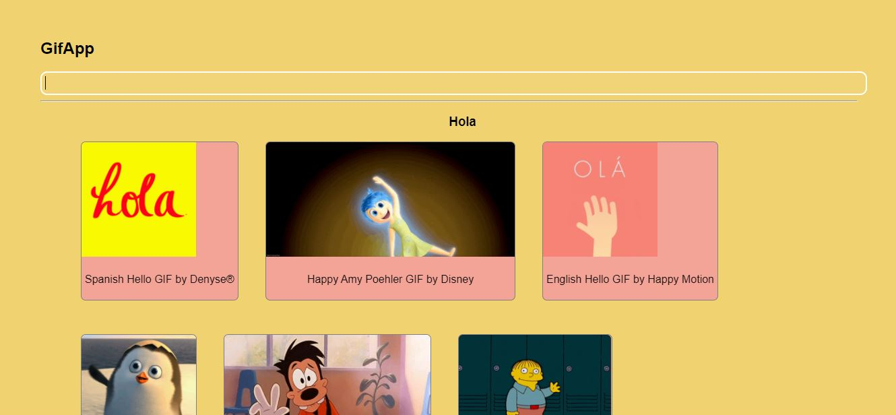
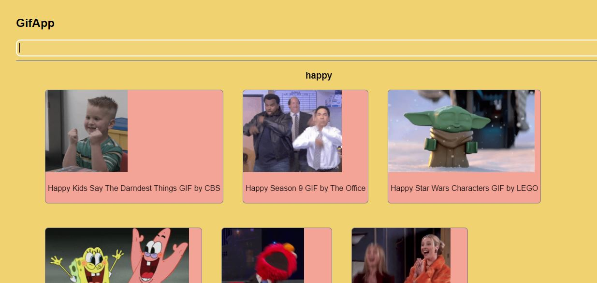

## The Firts App With React
If you any questions, you see documentation of React in this [link](https://create-react-app.dev/).

### Steps to view the project 
1. Access the app at this [link](https://elianruiz99.github.io/GifApp-react/).

### Steps to start the project as a developer:
1.  Clone the repository
2.  Start the command terminal
3.  Search for the folder where it's the proyect
4.  Start the proyect with the command: "npm start"

This proyect queries the API of GIPHY, in this [link](https://developers.giphy.com/) you can find more information about the API.
The project shows different Gifs using the keyword, for example:
1. Keyword: Hello
    

2. Keyword: Happy
    